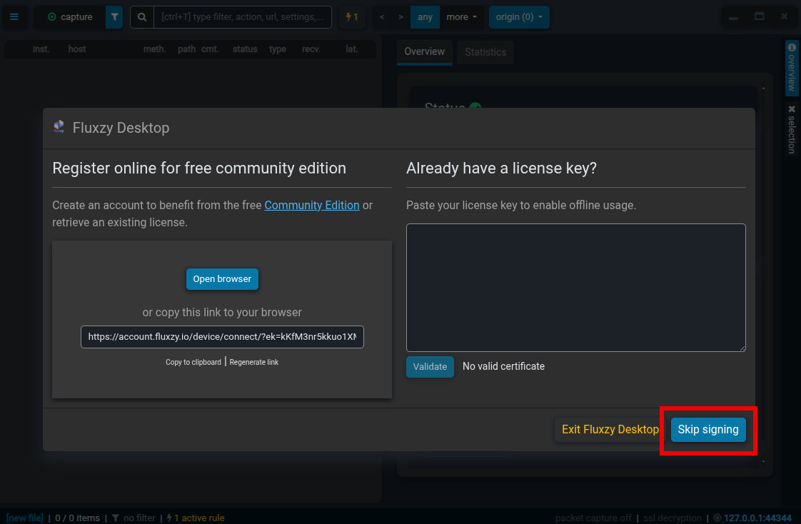
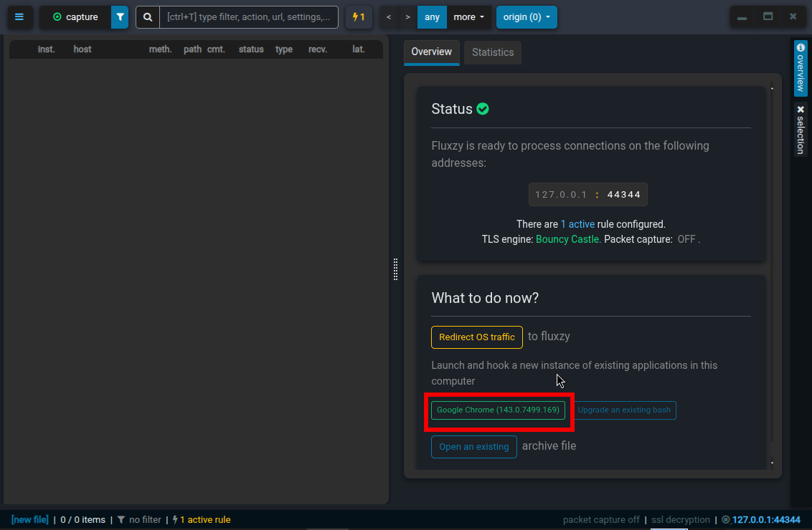
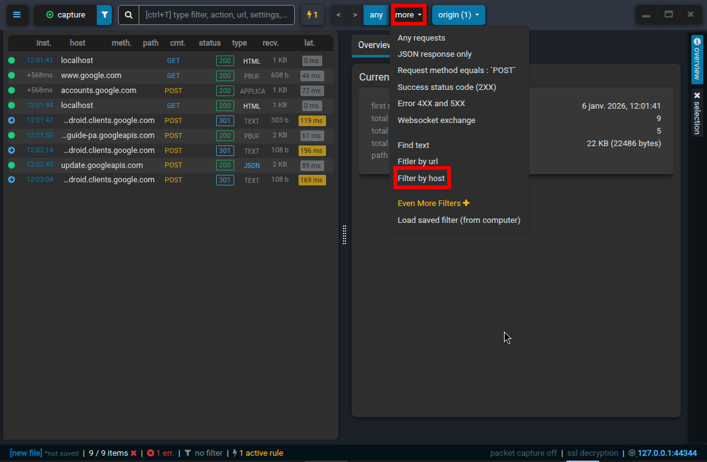
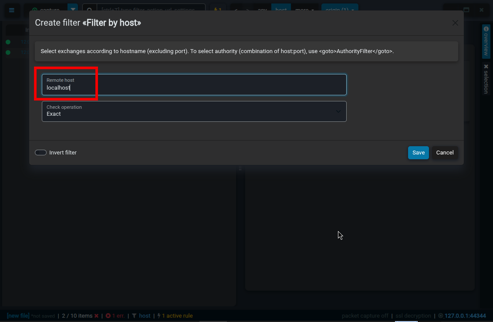

## Starting MCP POC Server

```
uv run python -m mcp_poc.main

---
$ py_mcp_poc > uv run python -m mcp_poc.main
INFO:     Started server process [553101]
INFO:     Waiting for application startup.
[01/04/26 19:12:59] INFO     StreamableHTTP session manager started                    streamable_http_manager.py:109
INFO:     Application startup complete.
INFO:     Uvicorn running on http://0.0.0.0:8000 (Press CTRL+C to quit)
```

## Running MCP Inspector

The MCP Inspector uses two ports, one for the Client (UI) and one for the Server (Proxy).

```
docker run --name mcp_inspector --network host \
  -e HOST=0.0.0.0 \
  -e CLIENT_PORT=6274 \
  -e SERVER_PORT=6277 \
  -e MCP_AUTO_OPEN_ENABLED=false \
  ghcr.io/modelcontextprotocol/inspector:0.18.0

---  
$ docker run --name mcp_inspector --network host \
  -e HOST=0.0.0.0 \
  -e CLIENT_PORT=6274 \
  -e SERVER_PORT=6277 \
  -e MCP_AUTO_OPEN_ENABLED=false \
  ghcr.io/modelcontextprotocol/inspector:0.18.0

> @modelcontextprotocol/inspector@0.18.0 start
> node client/bin/start.js

Starting MCP inspector...
⚙️  Proxy server listening on 0.0.0.0:6277
🔑 Session token: 9e8e28c495cea56118fb55fd294323c9bb159ebe5352c458e9fbdef47408bad5
   Use this token to authenticate requests or set DANGEROUSLY_OMIT_AUTH=true to disable auth

🚀 MCP Inspector is up and running at:
   http://0.0.0.0:6274/?MCP_PROXY_AUTH_TOKEN=9e8e28c495cea56118fb55fd294323c9bb159ebe5352c458e9fbdef47408bad5

```

**Running MCP Inspector _Disabling_ Proxy server authentication**

```
docker run --name mcp_inspector --network host \
  -e HOST=0.0.0.0 \
  -e CLIENT_PORT=6274 \
  -e SERVER_PORT=6277 \
  -e MCP_AUTO_OPEN_ENABLED=false \
  -e DANGEROUSLY_OMIT_AUTH=true \
  ghcr.io/modelcontextprotocol/inspector:0.18.0
  
---
$ docker run --name mcp-inspector --network host   -e HOST=0.0.0.0   -e CLIENT_PORT=6274   -e SERVER_PORT=6277   -e MCP_AUTO_OPEN_ENABLED=false -e DANGEROUSLY_OMIT_AUTH=true   ghcr.io/modelcontextprotocol/inspector:0.18.0

> @modelcontextprotocol/inspector@0.18.0 start
> node client/bin/start.js

Starting MCP inspector...
⚙️  Proxy server listening on 0.0.0.0:6277
⚠️   WARNING: Authentication is disabled. This is not recommended.

🚀 MCP Inspector is up and running at:
   http://0.0.0.0:6274
   
```

## Connecting MCP Inspector

* In browser open url http://localhost:6274
* Pick Transport Type: Streamble HTTP
* Add url: http://localhost:8000/mcp/
* Pick Connection Type: Via Proxy
* Under Configuration provide
    * Inspector Proxy Address: http://localhost:6277
    * Proxy Session
      Token [If MCP Inspector is started with proxy server authentication is enabled, provide session token value]

## Debugging MCP Client/Server Calls

[Fluxzy](https://fluxzy.io/resources/features/a-modern-http-debugger) (A fast and fully streamed MITM proxy to
intercept, record, and modify HTTP/1, HTTP/2, and WebSocket traffic, whether in plain or secured with TLS.) can be
leveraged for debugging MCP Client/Server calls for understanding different flows/payloads

[Fluxzy Desktop](https://fluxzy.io/resources/features/a-modern-http-debugger#download-fluxzy-desktop) provides better
features
compared to different types of installations (CLI & Core)

### Configuring Fluxzy

* Open Fluxzy Desktop and click Skip signing
  
* On the right side click Google Chrome to activate capturing of all web interactions for opened Chrome window
  
* Set filter by host
  
* Add host details (**localhost**)
  

In opened Google Chrome window launch MCP Inspector [Connecting MCP Inspector](#Connecting MCP Inspector)

## Execution Loop ("Agentic" Part)

For **tf.weather.safety** prompt outlined is high-level flow (when implemented correctly)

```
You are a weather safety assistant for 12345. 
1. First, read the safety guidelines from 'tf.weather.guidelines' (weather://guidelines).
2. Use the 'get_live_weather' tool with zipcode=12345.
3. Compare the live temp to the guidelines and give a recommendation.
```

Once user trigger the prompt (e.g., typing /tf.weather.safety), the following loop occurs:

* Context Injection: The Host/Agent App resolves the Prompt template into a standard instruction and sends it to the
  LLM. It also attaches the Resource content (the safety guidelines) directly into the LLM's context window so the model
  can "read" it immediately.
* Model Decision: The LLM reads the instructions and safety guidelines. It realizes it is missing the current
  temperature. It looks at its available Tools and generates a Tool Call (a structured JSON request).
* Agent Execution: The MCP Host (acting as the agent) sees the tool call, executes the code on the MCP Server, and
  retrieves the live weather data.
* Information Return: The Host sends the raw tool output (e.g., "Currently 102°F") back to the LLM as a new message in
  the conversation history.
* Final Summarization: The LLM now has all three pieces: the original goal (Prompt), the safety rules (Resource), and
  the live data (Tool Result). It summarizes these into a final recommendation: "It is 102°F in San Jose; based on the
  guidelines, this is in the 'Danger' zone. Please stay indoors."

### Summary of Responsibilities

| Component | Who Provides It | Who Uses It | Role                                          |
|-----------|-----------------|-------------|-----------------------------------------------|
| Prompt    | MCP Server      | User        | Inititates specific workflow template         |
| Resource  | MCP Server      | LLM         | Provides static context/reference data        |
| Tool      | MCP Server      | LLM         | Allows LLM to fetch live data                 |
| Agent     | MCP Host        | System      | Orchestrates calls between LLM and MCP Server |

## References

* [MCP Literature, SDKs, Servers](https://github.com/modelcontextprotocol)
* [MCP Inspector](https://github.com/modelcontextprotocol/inspector)
* [MCP Use](https://mcp-use.com/docs/inspector)
    * supports connecting to multiple mcp servers
    * supports interactive chat with LLM integration for testing conversational flows
* Fluxzy
    * [Fluxzy](https://github.com/haga-rak/fluxzy.core)
    * [Fluxzy Feature Comparison](https://www.fluxzy.io/resources/documentation/overview#features)
    * [Fluxzy Performance](https://fluxzy.io/resources/blogs/performance-benchmark-fluxzy-mitmproxy-mitmdump-squid)

* PyCharm
  * [PyCharm Help: Configure a uv environment](https://www.jetbrains.com/help/pycharm/uv.html)
  * [PyCharm Help: Run/Debug Configuration: uv run](https://www.jetbrains.com/help/pycharm/run-debug-configuration-uv.html)